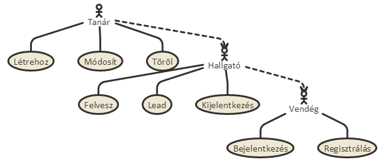

# Dokumentáció
## 1. Követelményanalízis
### Funkcionális követelmények

Megvalósítani egy tantárgyak felvételére, kezelésére szolgáló webes technológiákkal fejlesztett alkalmazást. Elvárt követelmények aminek tartalmaznia kell:

- legalább két modellt, egy-sok kapcsolatban
- legalább 1 űrlapot
- legalább 1 listázó oldalt
- legyen lehetőség új felvételére
- legyen lehetőség meglévő szerkesztésére
- legyen lehetőség meglévő törlésére
- legyenek benne csak hitelesítés után elérhető funkciók
- perzisztálás fájlba történjen
- közzététel Herokun

### Nem funkcionális követelmények

- Felhaszánálóbarát, ergonomikus elrendezés és kinézet
- Jelszavak tárolása, biztonság
- A weboldal könnyen bővíthető
- Teljesítmény, rendelkezésre állás
<<<<<<< HEAD

### Használatieset-modell
#### Szerepkörök
- **vendég**: nem rendezik jogosultsággal az oldal tartalmának megtekintéséhez, két dolgot tehet: bejelentkezik vagy regisztrál
- **hallgató**: megtekintheti a rendszerben levő tantárgyakat és azokat felveheti illetve leadhatja
- **tanár**: létrehozhat, törölhet és módosíthat tantárgyakat

## 2. Tervezés

 - Architektúra terv
komponensdiagram
Oldaltérkép
Végpontok
 - Felhasználóifelület-modell
Oldalvázlatok
Designterv (nem kell, elég a végső megvalósítás kinézete)
 - Osztálymodell
Adatmodell
Adatbázisterv
Állapotdiagram
 - Dinamikus működés
Szekvenciadiagram

## 3. Implementáció
## 4. Tesztelés
## 5. Felhasználói dokumentáció
