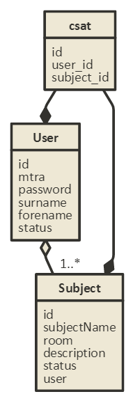

# Dokumentáció
## 1. Követelményanalízis
### Funkcionális követelmények

Megvalósítani egy tantárgyak felvételére, kezelésére szolgáló webes technológiákkal fejlesztett alkalmazást. Elvárt követelmények aminek tartalmaznia kell:

- legalább két modellt, egy-sok kapcsolatban
- legalább 1 űrlapot
- legalább 1 listázó oldalt
- legyen lehetőség új felvételére
- legyen lehetőség meglévő szerkesztésére
- legyen lehetőség meglévő törlésére
- legyenek benne csak hitelesítés után elérhető funkciók
- perzisztálás fájlba történjen
- közzététel Herokun

### Nem funkcionális követelmények

- Felhaszánálóbarát, ergonomikus elrendezés és kinézet
- Jelszavak tárolása, biztonság
- A weboldal könnyen bővíthető
- Teljesítmény, rendelkezésre állás

### Használatieset-modell
#### Szerepkörök
- **vendég**: nem rendezik jogosultsággal az oldal tartalmának megtekintéséhez, két dolgot tehet: bejelentkezik vagy regisztrál
- **hallgató**: megtekintheti a rendszerben levő tantárgyakat és azokat felveheti illetve leadhatja
- **tanár**: létrehozhat, törölhet és módosíthat tantárgyakat


#### Folyamat pontos menete: Regisztráció


## 2. Tervezés

### - Architektúra terv
komponensdiagram
####Oldaltérkép
Publikus:
- Bejelentkezés
- Regisztrálás
Regisztrált felhasználók számára:
- Bejelentkezés
- Kijelentkezés
- Tárgyak listázása
- Hallgatók számára:
  - Tárgy felvétele
  - Tárgy leadása
- Tanárok számára
  - Tárgy létrehozása
  - Tárgy módosítása
  - Tárgy törlése

####Végpontok
- GET /: login oldal vagy átirányítás a listanézetre
- POST /: bejelentkezési adatok elküldése
- GET /login: login oldal vagy átirányítás a listanézetre
- POST /login: bejelentkezési adatok elküldése
- GET /signup: regisztrációs oldal
- POST /signup: regisztrációs adatok elküldése
- GET /logout: kijelentkezés
- GET /list: tárgyak listázása
- GET /new: új tantárgy hozzáadása oldal
- POST /new: új tantárgy létrehozása
- GET /modify/:id : tantárgy módosítása
- POST /modify/:id : tantárgy módosított adatainak elküldése
- GET /delete/:id : létrehozott tantárgy törlése
- GET /remove/:id : törlés a felvett tárgyak közül

### - Felhasználóifelület-modell
####Oldalvázlatok
Bejelentkezés


Listanézet


### - Osztálymodell
Adatbázis táblák leírása
```
Név: user
Szinonímák: felhasználó, Felhasználó
Leírás: a felhasználói adatok tárolása ebben a táblában történik
Attribútumok:
    - id(egész): felhasználó azonosítója
    - mtra(szöveg): felhasználó mtra azonosítója
    - password: felhasználó jelszava (kódolt)
    - surname(szöveg): felhasználó vezetékneve
    - forename(szöveg): felhasználó keresztneve
    - role(szöveg): felhasználó jogosultsága
Kapcsolatok: 

Név: subject
Szinonímák: tantárgyak, tárgyak
Leírás: a tantárgyak tárolása ebben a táblában történik
Attribútumok:
    - id(egész): tantárgy azonosítója
    - subjectName(szöveg): tantárgy neve
    - status(boolean): elérhető-e a tárgy vagy sem
    - description(szöveg): tanterem
    - room(szöveg): tanterem
    - user(idő): tantárgy létrehozójának azonosítója
Kapcsolatok: tantárgy kapcsolása a felhasználóhoz

Név: csat
Szinonímák: csatolótábla
Leírás: a hallgató-tantárgy kapcsolatok tárolása ebben a táblában történik 
Attribútumok:
    - id(egész): tantárgy azonosítója
    - student_id(szöveg): hallgató azonosítója
    - subject_id(szöveg): tantárgy azonosítója
Kapcsolatok:
```
Adatbázisterv


## 3. Implementáció
### Fejlesztői környezet
Cloud9 webes fejlesztői környezet
Közzététel Herokun
### Könyvtárszerkezet
./img: tartalmazza a dokumentációhoz szükséges képeket
./models: adatmodelleket tartalmazza (user.js, subject.js, csat.js)
./controllers: végpontok vezérlői
./config: konfigurációs beállítások (waterline.js)
./views: a megjelenítéshez szükséges .hbs kiterjesztésű fájlok
./views/login: bejelentkezési oldalak
./views/subjects: tantárgyakkal kapcsolatos oldalak
./test: a teszteléshez szükséges fájlok
## 4. Tesztelés
###Tesztelési környezet
A user model került tesztelésre egységteszt segítségével, a következő funkciók lettek tesztelve:
- létrehozás
- módosítás
- törlés
- hibakezelés helytelen adatok esetén
- jelszóvalidáció
```
./test/usermodel.test.js
```
Funkcionális felületi tesztek: zombie.js használatával
A következő funkciók kerültek tesztelésre:
- bejelentkezés hibás és valid adatokkal
- tantárgy létrehozásahibás és valid adatokkal
```
./test/usermodel.test.js
```
###Tesztek futtatása:
```
npm test
```
Kimenet:

## 5. Felhasználói dokumentáció
### A futtatáshoz ajánlott hardver-, szoftver konfiguráció
Az alkalmazás használatához bármilyen böngésző megfelel.
A szervernek rendelkeznie kell Node.js-el.
### Telepítés lépései:
- Forrás beszerzése:
```
git clone https://github.com/knitomi90ELTE/alkfejl.git
```
- A program használata
```
node server.js
```
